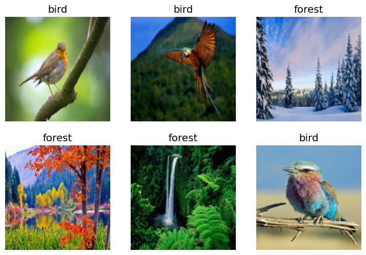

Practical-Deep-Learning-for-Coders-Lesson1
================

<!-- WARNING: THIS FILE WAS AUTOGENERATED! DO NOT EDIT! -->

This file will become your README and also the index of your
documentation.

## Is it a bird

``` sh
pip install Practical_Deep_Learning_for_Coders_Lesson1
```

``` python
from fastbook import *
```

``` python
urls = search_images_ddg('bird photos', max_images=1)
len(urls),urls[0]
```

    (1,
     'https://2.bp.blogspot.com/-g9STQqFQ9Ik/UScse2IifqI/AAAAAAAAA08/mh1immEtVZo/s1600/bluebird.jpg')

``` python
dest=Path('bird.jpg')
download_url(urls[0],dest,show_progress=False)
```

    Path('bird.jpg')

``` python
im = Image.open(dest)
im.to_thumb(256,256)
```


``` python
searches = 'forest','bird'
path = Path('bird_or_not')

if not path.exists():
    for o in searches:
        dest = (path/o)
        dest.mkdir(exist_ok=True, parents=True)
        results = search_images_ddg(f'{o} photo')
        download_images(dest, urls=results[:200])        
        resize_images(dest, max_size=400, dest=dest)
```

``` python
failed = verify_images(get_image_files(path))
failed.map(Path.unlink)
```

    (#35) [None,None,None,None,None,None,None,None,None,None...]

``` python
dls = DataBlock(
    blocks=(ImageBlock, CategoryBlock), 
    get_items=get_image_files, 
    splitter=RandomSplitter(valid_pct=0.2, seed=42),
    get_y=parent_label,
    item_tfms=[Resize(192, method='squish')]
).dataloaders(path, bs=32)

dls.show_batch(max_n=6)
```



``` python
learn = vision_learner(dls, resnet18, metrics=error_rate)
learn.fine_tune(3)
```

<style>
    /* Turns off some styling */
    progress {
        /* gets rid of default border in Firefox and Opera. */
        border: none;
        /* Needs to be in here for Safari polyfill so background images work as expected. */
        background-size: auto;
    }
    progress:not([value]), progress:not([value])::-webkit-progress-bar {
        background: repeating-linear-gradient(45deg, #7e7e7e, #7e7e7e 10px, #5c5c5c 10px, #5c5c5c 20px);
    }
    .progress-bar-interrupted, .progress-bar-interrupted::-webkit-progress-bar {
        background: #F44336;
    }
</style>
<table border="1" class="dataframe">
  <thead>
    <tr style="text-align: left;">
      <th>epoch</th>
      <th>train_loss</th>
      <th>valid_loss</th>
      <th>error_rate</th>
      <th>time</th>
    </tr>
  </thead>
  <tbody>
    <tr>
      <td>0</td>
      <td>0.490227</td>
      <td>0.029793</td>
      <td>0.014925</td>
      <td>00:05</td>
    </tr>
  </tbody>
</table>

<style>
    /* Turns off some styling */
    progress {
        /* gets rid of default border in Firefox and Opera. */
        border: none;
        /* Needs to be in here for Safari polyfill so background images work as expected. */
        background-size: auto;
    }
    progress:not([value]), progress:not([value])::-webkit-progress-bar {
        background: repeating-linear-gradient(45deg, #7e7e7e, #7e7e7e 10px, #5c5c5c 10px, #5c5c5c 20px);
    }
    .progress-bar-interrupted, .progress-bar-interrupted::-webkit-progress-bar {
        background: #F44336;
    }
</style>
<table border="1" class="dataframe">
  <thead>
    <tr style="text-align: left;">
      <th>epoch</th>
      <th>train_loss</th>
      <th>valid_loss</th>
      <th>error_rate</th>
      <th>time</th>
    </tr>
  </thead>
  <tbody>
    <tr>
      <td>0</td>
      <td>0.058664</td>
      <td>0.000246</td>
      <td>0.000000</td>
      <td>00:06</td>
    </tr>
    <tr>
      <td>1</td>
      <td>0.034803</td>
      <td>0.000772</td>
      <td>0.000000</td>
      <td>00:07</td>
    </tr>
    <tr>
      <td>2</td>
      <td>0.023400</td>
      <td>0.000273</td>
      <td>0.000000</td>
      <td>00:07</td>
    </tr>
  </tbody>
</table>
