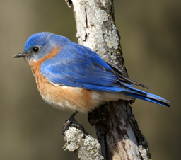

Practical-Deep-Learning-for-Coders-Lesson1
================

<!-- WARNING: THIS FILE WAS AUTOGENERATED! DO NOT EDIT! -->

This file will become your README and also the index of your
documentation.

## Is it a bird

``` sh
pip install Practical_Deep_Learning_for_Coders_Lesson1
```

``` python
from fastbook import *
```

``` python
urls = search_images_ddg('bird photos', max_images=1)
len(urls),urls[0]
```

    (1,
     'https://2.bp.blogspot.com/-g9STQqFQ9Ik/UScse2IifqI/AAAAAAAAA08/mh1immEtVZo/s1600/bluebird.jpg')

``` python
dest=Path('bird.jpg')
download_url(urls[0],dest)
```

<style>
    /* Turns off some styling */
    progress {
        /* gets rid of default border in Firefox and Opera. */
        border: none;
        /* Needs to be in here for Safari polyfill so background images work as expected. */
        background-size: auto;
    }
    progress:not([value]), progress:not([value])::-webkit-progress-bar {
        background: repeating-linear-gradient(45deg, #7e7e7e, #7e7e7e 10px, #5c5c5c 10px, #5c5c5c 20px);
    }
    .progress-bar-interrupted, .progress-bar-interrupted::-webkit-progress-bar {
        background: #F44336;
    }
</style>

    <div>
      <progress value='303104' class='' max='295068' style='width:300px; height:20px; vertical-align: middle;'></progress>
      102.72% [303104/295068 00:00&lt;00:00]
    </div>
    

    Path('bird.jpg')

``` python
im = Image.open(dest)
im.to_thumb(256,256)
```


